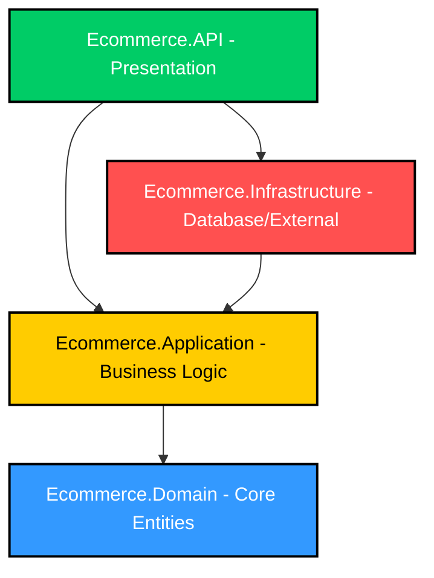

# Ecommerce Clean Architecture Refactoring Plan

This document outlines the step-by-step plan to refactor the current **Ecommerce** backend into a **Clean Architecture** structure. Refactoring the project will decouple the Domain logic, Application business logic, Infrastructure details (database, filesystems), and Presentation (API/controllers).

---

## 1. Architectural Overview & Dependency Flow

Clean Architecture organizes the system into circular layers where dependencies only point inward:



### Layer Definitions

| Layer Project | Responsibility | Dependencies | Key Components |
| :--- | :--- | :--- | :--- |
| **`Ecommerce.Domain`** | Enterprise business rules, domain entities, enums. | **None** (zero dependencies on EF Core, ASP.NET, etc.) | Entities, Enums, Value Objects |
| **`Ecommerce.Application`** | Application business logic, use cases, abstractions. | `Ecommerce.Domain` | Service Interfaces, Repository Interfaces, DTOs, Mappers, Services |
| **`Ecommerce.Infrastructure`** | Database access, EF Core, external services, data seeding. | `Ecommerce.Application` (and transitively `Domain`) | DbContext, Repositories, Storage Service implementations, Migrations, Seeders |
| **`Ecommerce.API`** | Presentation layer, entry point, HTTP routing, middleware. | `Ecommerce.Application`, `Ecommerce.Infrastructure` | Controllers, Middlewares, Program.cs, Configuration extensions |

---

## 2. Project Creation and Reference Setup

Run the following commands in your workspace root (`e:\Ecommerce`) to create the projects and set up correct references:

### Step 2.1: Create Class Libraries
```powershell
# Create Domain layer
dotnet new classlib -n Ecommerce.Domain -o Ecommerce.Domain

# Create Application layer
dotnet new classlib -n Ecommerce.Application -o Ecommerce.Application

# Create Infrastructure layer
dotnet new classlib -n Ecommerce.Infrastructure -o Ecommerce.Infrastructure
```

### Step 2.2: Add Projects to Solution (`Ecommerce.slnx`)
Open your solution file `e:\Ecommerce\Ecommerce.slnx` and add the new projects. It should look like this:

```xml
<Solution>
  <Folder Name="/src/">
    <Project Path="Ecommerce.API/Ecommerce.API.csproj" />
    <Project Path="Ecommerce.Domain/Ecommerce.Domain.csproj" />
    <Project Path="Ecommerce.Application/Ecommerce.Application.csproj" />
    <Project Path="Ecommerce.Infrastructure/Ecommerce.Infrastructure.csproj" />
  </Folder>
  <Folder Name="/tests/" />
</Solution>
```

### Step 2.3: Establish Project References
Run these commands to hook up references between layers:
```powershell
# Application depends on Domain
dotnet add Ecommerce.Application/Ecommerce.Application.csproj reference Ecommerce.Domain/Ecommerce.Domain.csproj

# Infrastructure depends on Application
dotnet add Ecommerce.Infrastructure/Ecommerce.Infrastructure.csproj reference Ecommerce.Application/Ecommerce.Application.csproj

# API (Presentation) depends on both Application and Infrastructure
dotnet add Ecommerce.API/Ecommerce.API.csproj reference Ecommerce.Application/Ecommerce.Application.csproj
dotnet add Ecommerce.API/Ecommerce.API.csproj reference Ecommerce.Infrastructure/Ecommerce.Infrastructure.csproj
```

---

## 3. Package Dependencies Alignment

We need to extract the NuGet packages from `Ecommerce.API.csproj` and place them only where necessary.

### 3.1 `Ecommerce.Domain`
Needs minimal dependencies. Because `AppUser` and `AppRole` inherit from ASP.NET Core Identity models, we will add the lightweight Identity stores package.
```powershell
dotnet add Ecommerce.Domain/Ecommerce.Domain.csproj package Microsoft.Extensions.Identity.Stores
```

### 3.2 `Ecommerce.Application`
Needs dependencies for DI abstractions:
```powershell
dotnet add Ecommerce.Application/Ecommerce.Application.csproj package Microsoft.Extensions.DependencyInjection.Abstractions
```

### 3.3 `Ecommerce.Infrastructure`
Needs Entity Framework Core, PostgreSQL, Bogus (for seeding), and Identity EF Core integration:
```powershell
dotnet add Ecommerce.Infrastructure/Ecommerce.Infrastructure.csproj package Microsoft.EntityFrameworkCore
dotnet add Ecommerce.Infrastructure/Ecommerce.Infrastructure.csproj package Npgsql.EntityFrameworkCore.PostgreSQL
dotnet add Ecommerce.Infrastructure/Ecommerce.Infrastructure.csproj package Microsoft.AspNetCore.Identity.EntityFrameworkCore
dotnet add Ecommerce.Infrastructure/Ecommerce.Infrastructure.csproj package Bogus

# If code in Infrastructure needs to perform CLI migrations:
dotnet add Ecommerce.Infrastructure/Ecommerce.Infrastructure.csproj package Microsoft.EntityFrameworkCore.Tools
```

### 3.4 `Ecommerce.API`
Keep only web-related dependencies:
```xml
<PackageReference Include="Microsoft.AspNetCore.Authentication.JwtBearer" Version="9.0.19" />
<PackageReference Include="Swashbuckle.AspNetCore" Version="9.0.6" />
```

---

## 4. Step-by-Step File Relocation Inventory

Below is the inventory of files that should be moved from `Ecommerce.API` to the new projects, along with their namespace adjustments.

### 4.1 Moving to `Ecommerce.Domain`
Move these files to `Ecommerce.Domain/Entities/` and `Ecommerce.Domain/Enums/`:

*   **Folder Location**: Move `Ecommerce.API/Entities/*` to `Ecommerce.Domain/Entities/`
    *   *Change namespace to*: `Ecommerce.Domain.Entities`
*   **Folder Location**: Move `Ecommerce.API/Enum/*` to `Ecommerce.Domain/Enums/`
    *   *Change namespace to*: `Ecommerce.Domain.Enums`
*   **Folder Location**: Move `Ecommerce.API/Exceptions/*` to `Ecommerce.Domain/Exceptions/` (or Application/Exceptions depending on preference)
    *   *Change namespace to*: `Ecommerce.Domain.Exceptions`

### 4.2 Moving to `Ecommerce.Application`
Move these files to `Ecommerce.Application/`:

| Current Location in API | Target Location in Application | Target Namespace |
| :--- | :--- | :--- |
| `DTO/*` | `DTOs/*` | `Ecommerce.Application.DTOs` |
| `Interfaces/*` | `Interfaces/*` (e.g. `ICartService`, `IProductService`) | `Ecommerce.Application.Interfaces` |
| `RepoContracts/*` | `RepoContracts/*` (e.g. `IProductRepository`) | `Ecommerce.Application.RepoContracts` |
| `Services/*` (Except below) | `Services/*` (`ProductService`, `CartService`, `CategoryService`) | `Ecommerce.Application.Services` |
| `Mapster/*` | `Mappers/*` (or `Mapster/*`) | `Ecommerce.Application.Mappers` |
| `Helpers/FileHelper.cs` | `Common/Helpers/FileHelper.cs` | `Ecommerce.Application.Common.Helpers` |

### 4.3 Moving to `Ecommerce.Infrastructure`
Move database, repository, external service implementations, and seeding logic to `Ecommerce.Infrastructure/`:

| Current Location in API | Target Location in Infrastructure | Target Namespace |
| :--- | :--- | :--- |
| `Database/AppDbContext.cs` | `Database/AppDbContext.cs` | `Ecommerce.Infrastructure.Database` |
| `Repositories/*` | `Repositories/*` (e.g. `ProductRepository.cs`) | `Ecommerce.Infrastructure.Repositories` |
| `Seeders/*` | `Seeders/*` (and `JsonFiles` directory) | `Ecommerce.Infrastructure.Seeders` |
| `Services/StorageService.cs` | `Storage/StorageService.cs` (uses file/directory IO) | `Ecommerce.Infrastructure.Storage` |
| `Services/TokenService.cs` | `Security/TokenService.cs` (uses JWT generation) | `Ecommerce.Infrastructure.Security` |
| `Migrations/*` | `Migrations/*` (EF migrations move here) | `Ecommerce.Infrastructure.Migrations` |

### 4.4 Remaining in `Ecommerce.API`
Keep the following files in `Ecommerce.API`:
*   `Controllers/*` (e.g., `ProductController.cs`, `AuthController.cs`)
*   `Middleware/GlobalExceptionMiddleware.cs`
*   `Configurations/JwtConfiguration.cs`
*   `Program.cs`
*   `appsettings.json` / `appsettings.Development.json`

---

## 5. Architectural Adjustments and Design Patterns

While refactoring, you will encounter compilation issues related to circular references or mixing layers. Use the patterns below to resolve them:

### 5.1 Decoupling DbContext from Application Services
In `AuthService.cs`, you currently inject `AppDbContext` to execute database transactions:
```csharp
await using var transaction = await _dbContext.Database.BeginTransactionAsync(cancellationToken);
```
**Problem**: The Application layer cannot reference `AppDbContext` since it resides in the Infrastructure layer.
**Solutions**:
1.  **Unit of Work Pattern**: Define `IUnitOfWork` interface in `Ecommerce.Application.RepoContracts`:
    ```csharp
    public interface IUnitOfWork : IDisposable
    {
        Task<IDbContextTransaction> BeginTransactionAsync(CancellationToken cancellationToken = default);
        Task SaveChangesAsync(CancellationToken cancellationToken = default);
    }
    ```
    Implement it in `Ecommerce.Infrastructure.Repositories.UnitOfWork` using `AppDbContext`.
2.  **Move Transaction Responsibility**: Move transaction management down into `AppUserRepository` or a dedicated repository class in Infrastructure, allowing the Application service to remain database-agnostic.

---

## 6. Splitting Dependency Registration

To keep dependency registration clean, you will expose dependency injection extension methods in each project and call them from `Program.cs`.

### Step 6.1: Application Services Registration
Create `DependencyInjection.cs` in `Ecommerce.Application`:

```csharp
using Microsoft.Extensions.DependencyInjection;
using Ecommerce.Application.Interfaces;
using Ecommerce.Application.Services;

namespace Ecommerce.Application;

public static class DependencyInjection
{
    public static IServiceCollection AddApplicationServices(this IServiceCollection services)
    {
        services.AddScoped<IAuthService, AuthService>();
        services.AddScoped<IProductService, ProductService>();
        services.AddScoped<ICartService, CartService>();
        services.AddScoped<ICategoryService, CategoryService>();
        
        return services;
    }
}
```

### Step 6.2: Infrastructure Services Registration
Create `DependencyInjection.cs` in `Ecommerce.Infrastructure`:

```csharp
using Microsoft.Extensions.DependencyInjection;
using Microsoft.Extensions.Configuration;
using Microsoft.EntityFrameworkCore;
using Ecommerce.Application.RepoContracts;
using Ecommerce.Application.Interfaces;
using Ecommerce.Infrastructure.Database;
using Ecommerce.Infrastructure.Repositories;
using Ecommerce.Infrastructure.Storage;
using Ecommerce.Infrastructure.Security;

namespace Ecommerce.Infrastructure;

public static class DependencyInjection
{
    public static IServiceCollection AddInfrastructureServices(this IServiceCollection services, IConfiguration configuration)
    {
        string databaseUrl = configuration.GetConnectionString("Default") ?? throw new Exception("Database string not found.");
        services.AddDbContext<AppDbContext>(options => options.UseNpgsql(databaseUrl));

        // Repositories
        services.AddScoped<IAppUserRepository, AppUserRepository>();
        services.AddScoped<IProductRepository, ProductRepository>();
        services.AddScoped<ICartRepository, CartRepository>();
        services.AddScoped<ICategoryRepository, CategoryRepository>();

        // Infra services
        services.AddScoped<IStorageService, StorageService>();
        services.AddScoped<ITokenService, TokenService>();

        return services;
    }
}
```

### Step 6.3: Web API Configuration (`Program.cs` / `ConfigureService.cs`)
Modify the `ConfigureProjectServices` extension method in `Ecommerce.API/Extension/ConfigureService.cs` (or move it directly to `Program.cs`):

```csharp
using Ecommerce.Application;
using Ecommerce.Infrastructure;
// ... (Identity namespaces and Jwt configurations remain)

public static class ConfigureService
{
    public static IServiceCollection ConfigureProjectServices(this IServiceCollection services, IConfiguration configuration)
    {
        // 1. Web API Concerns (CORS, Controllers, Swagger)
        services.AddCors(options => { ... });
        services.AddControllers();
        services.AddEndpointsApiExplorer();
        services.AddSwaggerGen(options => { ... });

        // 2. Identity and Authentication Pipeline Setup
        services.AddIdentity<AppUser, AppRole>()
            .AddEntityFrameworkStores<AppDbContext>()
            .AddDefaultTokenProviders();

        services.Configure<JwtConfiguration>(configuration.GetSection("JwtConfiguration"));
        // Configure JWT Auth (AddAuthentication / AddJwtBearer) ...

        // 3. Register Core layers
        services.AddApplicationServices();
        services.AddInfrastructureServices(configuration);

        return services;
    }
}
```

---

## 7. Migration Commands Post-Refactor

Since migrations are moving to `Ecommerce.Infrastructure`, you will run migrations command targeting the Infrastructure project:

```powershell
# When adding migrations
dotnet ef migrations add <MigrationName> --project Ecommerce.Infrastructure --startup-project Ecommerce.API --output-dir Database/Migrations

# When updating database
dotnet ef database update --project Ecommerce.Infrastructure --startup-project Ecommerce.API
```
